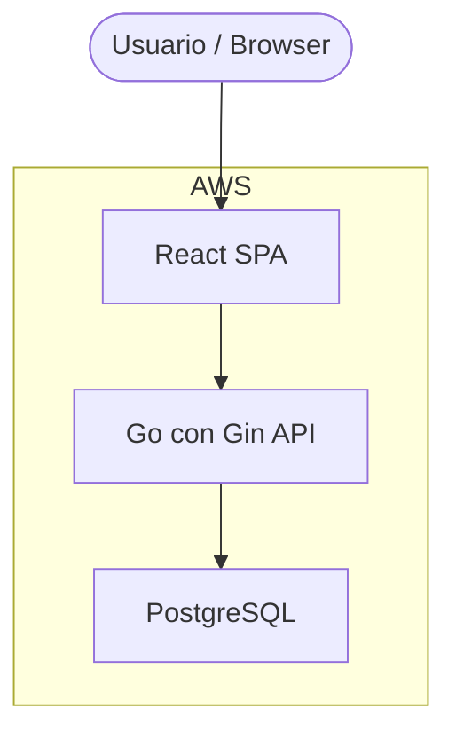
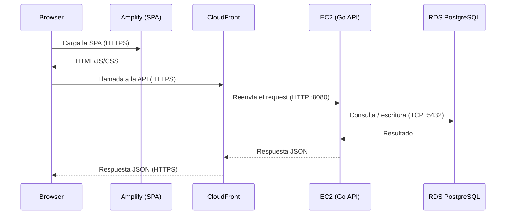

# Logitrack — Arquitectura

## Descripción general

Logitrack es un monorepo con dos servicios independientes desplegados en AWS:

- **Frontend**: SPA en React, alojada en AWS Amplify
- **Backend**: API REST en Go + Gin, conectada a DB PostgreSQL

---

## Diagrama de infraestructura

---

## Componentes

### AWS Amplify — Frontend

- Aloja la SPA de React + Vite.
- **Deploy automático**: cada push a `main` en GitHub dispara un nuevo build.

### AWS CloudFront — Proxy HTTPS

- Se ubica delante del EC2 para terminar TLS.
- **Por qué existe**: Amplify sirve el frontend por HTTPS. Los browsers bloquean llamadas HTTP desde páginas HTTPS (mixed content). El EC2 no tiene dominio propio ni certificado SSL, por lo que CloudFront maneja TLS.

### EC2 — Backend

- Corre la API Go + Gin en el puerto 8080.

### RDS — Base de datos

- PostgreSQL 17.4.

---

## Flujo de un request

---
